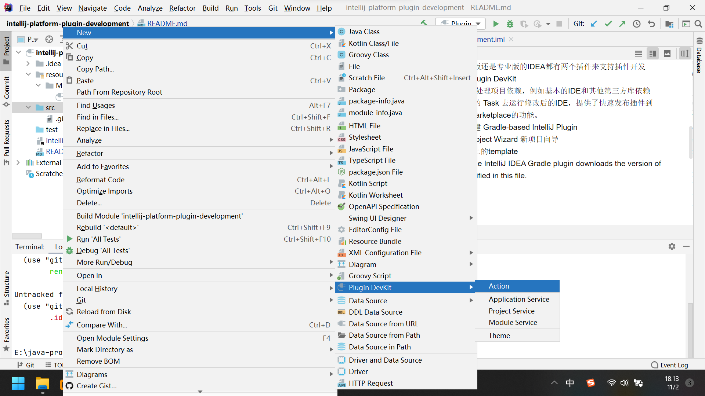

# IntelliJ Platform 插件开发

## 需要

+ IDE
  
    可以使用 IntelliJ IDEA Community Edition 或者 IntelliJ IDEA Ultimate

    推荐使用最新版的IDE

+ IntelliJ Platform SDK
    
    类似Java SDK，用来开发插件、主题或定制编辑器

+ Plugin DevKit

    插件开发套件，用来方便插件开发，默认已安装

+ Java SDK

    When targeting 2020.3 and later only, using Java 11 is required. See the IntelliJ project migrates to Java 11 blog post for details.
  
    When targeting 2022.2 and later only, using Java 17 is required.

  https://plugins.jetbrains.com/docs/intellij/creating-plugin-project.html#components-of-a-wizard-generated-gradle-intellij-platform-plugin

https://plugins.jetbrains.com/docs/intellij/plugin-required-experience.html

## 官方推荐 Gradle IntelliJ Plugin 

+ 不管是社区版还是专业版的IDEA都有两个插件来支持插件开发

    Gradle 和 Plugin DevKit

+ Gradle 能够处理项目依赖，例如基本的IDE和其他第三方库依赖

+ 提供了相关的 Task 去运行修改后的IDE，提供了快速发布插件到 JetBrains Marketplace的功能。

+ 两种方式创建 Gradle-based IntelliJ Plugin

    1. New Project Wizard 新项目向导
    2. Github上的template
        
+  If needed, the IntelliJ IDEA Gradle plugin downloads the version of Gradle specified in this file.

## 文档

https://plugins.jetbrains.com/docs/intellij/welcome.html

## 概念

1. IntelliJ Platform

    IntelliJ Platform 是一个平台，IntelliJ IDEA、PyCharm、Clion、PHPStorm等IDE都是基于这个平台开发出来的。

    另外IntelliJ Platform 不是一个产品，只是开发其他IDE的平台，这个平台是开源的，其他公司可以使用该平台进行开发自己的IDE，例如谷歌的Android Studio。

    https://github.com/JetBrains/intellij-community

2. SDK
   
    软件开发套件
   
3. Kit

    套件
   
## 官方表示 官方文档是不全的

https://plugins.jetbrains.com/docs/intellij/plugin-required-experience.html

Please keep in mind that the IntelliJ Platform is a large project, and while we are doing our best to cover as many topics as possible, it is not possible to include every feature and use-case in the documentation. Developing a plugin will sometimes require digging into the Platform code and analyzing the example implementations in other plugins.

## 截图 

## Plugin Devkit 插件开发套件

如果 disabled，则无法快捷创建 action

创建action建议在src目录右键创建，否者包名可能会比较乱  
或者创建好包名后，在右键具体包名进行创建

## IDE启动命令

D:\java\jdk-11.0.16\bin\java.exe -Xmx512m -Xms256m -ea -Didea.config.path=C:\Users\zhouh\AppData\Local\JetBrains\IntelliJIdea2020.3\plugins-sandbox\config -Didea.system.path=C:\Users\zhouh\AppData\Local\JetBrains\IntelliJIdea2020.3\plugins-sandbox\system -Didea.plugins.path=C:\Users\zhouh\AppData\Local\JetBrains\IntelliJIdea2020.3\plugins-sandbox\plugins -Didea.classpath.index.enabled=false -Didea.required.plugins.id=a-test-plugin-id "-javaagent:D:\jetbrains\IntelliJ IDEA 2020.3.4\lib\idea_rt.jar=56852:D:\jetbrains\IntelliJ IDEA 2020.3.4\bin" -Dfile.encoding=GBK -classpath "D:\jetbrains\IntelliJ IDEA 2020.3.4\lib\log4j.jar;D:\jetbrains\IntelliJ IDEA 2020.3.4\lib\jdom.jar;D:\jetbrains\IntelliJ IDEA 2020.3.4\lib\trove4j.jar;D:\jetbrains\IntelliJ IDEA 2020.3.4\lib\openapi.jar;D:\jetbrains\IntelliJ IDEA 2020.3.4\lib\util.jar;D:\jetbrains\IntelliJ IDEA 2020.3.4\lib\extensions.jar;D:\jetbrains\IntelliJ IDEA 2020.3.4\lib\bootstrap.jar;D:\jetbrains\IntelliJ IDEA 2020.3.4\lib\idea_rt.jar;D:\jetbrains\IntelliJ IDEA 2020.3.4\lib\idea.jar" com.intellij.idea.test.Main

com.intellij.idea.Main是程序的入口类

## 图标和图片

https://plugins.jetbrains.com/docs/intellij/work-with-icons-and-images.html#png-format
