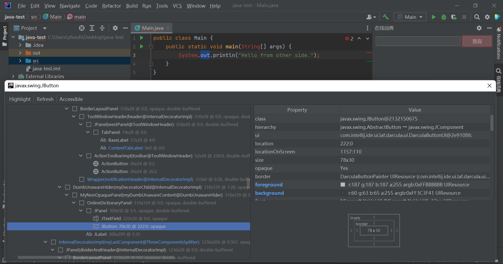

# IntelliJ Platform 插件开发

## 需要

+ IDE
  
    可以使用 IntelliJ IDEA Community Edition 或者 IntelliJ IDEA Ultimate

    推荐使用最新版的IDE

+ IntelliJ Platform SDK
    
    类似Java SDK，用来开发插件、主题或定制编辑器

+ Plugin DevKit

    插件开发套件，用来方便插件开发，默认已安装

+ Java SDK

    When targeting 2020.3 and later only, using Java 11 is required. See the IntelliJ project migrates to Java 11 blog post for details.
  
    When targeting 2022.2 and later only, using Java 17 is required.

  https://plugins.jetbrains.com/docs/intellij/creating-plugin-project.html#components-of-a-wizard-generated-gradle-intellij-platform-plugin

https://plugins.jetbrains.com/docs/intellij/plugin-required-experience.html

## 官方推荐 Gradle IntelliJ Plugin 

+ 不管是社区版还是专业版的IDEA都有两个插件来支持插件开发

    Gradle 和 Plugin DevKit

+ Gradle 能够处理项目依赖，例如基本的IDE和其他第三方库依赖

+ 提供了相关的 Task 去运行修改后的IDE，提供了快速发布插件到 JetBrains Marketplace的功能。

+ 两种方式创建 Gradle-based IntelliJ Plugin

    1. New Project Wizard 新项目向导
    2. Github上的template
        
+  If needed, the IntelliJ IDEA Gradle plugin downloads the version of Gradle specified in this file.

## 文档

https://plugins.jetbrains.com/docs/intellij/welcome.html

## 概念

1. IntelliJ Platform

    IntelliJ Platform 是一个平台，IntelliJ IDEA、PyCharm、Clion、PHPStorm等IDE都是基于这个平台开发出来的。

    另外IntelliJ Platform 不是一个产品，只是开发其他IDE的平台，这个平台是开源的，其他公司可以使用该平台进行开发自己的IDE，例如谷歌的Android Studio。

    https://github.com/JetBrains/intellij-community

2. SDK
   
    软件开发套件
   
3. Kit

    套件
   
## 官方表示 官方文档是不全的

https://plugins.jetbrains.com/docs/intellij/plugin-required-experience.html

Please keep in mind that the IntelliJ Platform is a large project, and while we are doing our best to cover as many topics as possible, it is not possible to include every feature and use-case in the documentation. Developing a plugin will sometimes require digging into the Platform code and analyzing the example implementations in other plugins.

## 截图 


## Plugin Devkit 插件开发套件

如果 disabled，则无法快捷创建 action

创建action建议在src目录右键创建，否者包名可能会比较乱  
或者创建好包名后，在右键具体包名进行创建

## IDE启动命令

D:\java\jdk-11.0.16\bin\java.exe -Xmx512m -Xms256m -ea -Didea.config.path=C:\Users\zhouh\AppData\Local\JetBrains\IntelliJIdea2020.3\plugins-sandbox\config -Didea.system.path=C:\Users\zhouh\AppData\Local\JetBrains\IntelliJIdea2020.3\plugins-sandbox\system -Didea.plugins.path=C:\Users\zhouh\AppData\Local\JetBrains\IntelliJIdea2020.3\plugins-sandbox\plugins -Didea.classpath.index.enabled=false -Didea.required.plugins.id=a-test-plugin-id "-javaagent:D:\jetbrains\IntelliJ IDEA 2020.3.4\lib\idea_rt.jar=56852:D:\jetbrains\IntelliJ IDEA 2020.3.4\bin" -Dfile.encoding=GBK -classpath "D:\jetbrains\IntelliJ IDEA 2020.3.4\lib\log4j.jar;D:\jetbrains\IntelliJ IDEA 2020.3.4\lib\jdom.jar;D:\jetbrains\IntelliJ IDEA 2020.3.4\lib\trove4j.jar;D:\jetbrains\IntelliJ IDEA 2020.3.4\lib\openapi.jar;D:\jetbrains\IntelliJ IDEA 2020.3.4\lib\util.jar;D:\jetbrains\IntelliJ IDEA 2020.3.4\lib\extensions.jar;D:\jetbrains\IntelliJ IDEA 2020.3.4\lib\bootstrap.jar;D:\jetbrains\IntelliJ IDEA 2020.3.4\lib\idea_rt.jar;D:\jetbrains\IntelliJ IDEA 2020.3.4\lib\idea.jar" com.intellij.idea.test.Main

com.intellij.idea.Main是程序的入口类

## 图标和图片

https://plugins.jetbrains.com/docs/intellij/work-with-icons-and-images.html#png-format

## JBR

JetBrains产品自带的JDK，改自OpenJDK，考虑到商业版权，没使用Oracle JDK或其他JDK

[JetBrains/JetBrainsRuntime: Runtime environment based on OpenJDK for running IntelliJ Platform-based products on Windows, macOS, and Linux (github.com)](https://github.com/JetBrains/JetBrainsRuntime)

JetBrainsRuntime

微调OpenJDK

Oracle JDK vs OpenJDK


2020.1 及以上版本为：jbr 目录  
2019.3.x 及以下版本为：jre32/64 目录

## 开发插件的两种方式

+ 不使用依赖管理工具
+ 使用依赖管理工具 Gradle 语言可用 Java或Kotlin
    + Github 模板
    + New Project
    
## 启用断言

D:\java\jdk-11.0.16\bin\java.exe -Xmx512m -Xms256m -ea

https://docs.oracle.com/en/java/javase/11/tools/java.html#GUID-3B1CE181-CD30-4178-9602-230B800D4FAE

-disableassertions[:[packagename]...|:classname] or -da[:[packagename]...|:classname]
Disables assertions. By default, assertions are disabled in all packages and classes. 

Java默认禁用断言，assert语句会被忽略，要启用断言，  
需要添加JVM选项-enableassertions或-ea

在其他项目中，可以使用Spring、JUnit等框架的Assert工具类来进行assert关键字的功能
因为很有可能生产环境忘记开启断言
也许可以启动前保证断言必须开启来解决忘记开启的问题

## 窗口启动流程

1. com.intellij.idea.Main:main()
2. com.intellij.ide.plugins.MainRunner:start()
3. com.intellij.idea.StartupUtil:prepareApp()
4. com.intellij.idea.StartupUtil:startApp()
5. getAppStarter(appStarterFuture).start(Arrays.asList(args), initUiTask);
6. com.intellij.idea.MainImpl:start()

## 主窗口

com.intellij.openapi.wm.impl.IdeFrameImpl

## InteliJ Community 编译 运行 

https://github.com/JetBrains/intellij-community

出现报错`intellij-community-idea-213.7172.25\intellij-community-idea-213.7172.25\plugins\gradle\gradle-dependency-updater\src\org\jetbrains\plugins\gradle\dsl\GradleDependencyModificator.kt:9:12
Kotlin: Unresolved reference: android`

运行getPlugins.bat，其实是拉取

`call git clone git://git.jetbrains.org/idea/android.git android`

`https://github.com/JetBrains/android`

确保 intellij-platform和android 仓库代码版本相同

主版本可能还会报错


可以试试，两个版本不一样可能会有奇怪报错

https://github.com/JetBrains/intellij-community/tree/idea/212.3116.43
https://github.com/JetBrains/android/tree/idea/212.3116.43

## Action注册

Action ID 默认是 类名，不包括包名的类名

ActionManagerImpl.registerAction()

`public void registerAction(@NotNull String actionId, @NotNull AnAction action, @Nullable PluginId pluginId, @Nullable String projectType) {
`
```
com.intellij.diagnostic.PluginException: ID "SearchWithBingAction" is already taken by action "必应搜索 (null)" (Plugin: 网页搜索). Action "百度搜索 (null)" cannot use the same ID 网页搜索 [Plugin: 网页搜索]
	at com.intellij.openapi.actionSystem.impl.ActionManagerImpl.reportActionIdCollision(ActionManagerImpl.java:1316)
	at com.intellij.openapi.actionSystem.impl.ActionManagerImpl.registerAction(ActionManagerImpl.java:1249)
	at com.intellij.openapi.actionSystem.impl.ActionManagerImpl.registerOrReplaceActionInner(ActionManagerImpl.java:702)
	at com.intellij.openapi.actionSystem.impl.ActionManagerImpl.processActionElement(ActionManagerImpl.java:672)
	at com.intellij.openapi.actionSystem.impl.ActionManagerImpl.processGroupElement(ActionManagerImpl.java:830)
	at com.intellij.openapi.actionSystem.impl.ActionManagerImpl.registerPluginActions(ActionManagerImpl.java:472)
	at com.intellij.openapi.actionSystem.impl.ActionManagerImpl.registerActions(ActionManagerImpl.java:172)
	at com.intellij.openapi.actionSystem.impl.ActionManagerImpl.<init>(ActionManagerImpl.java:144)
	at com.jetbrains.rdserver.ui.actionPopupMenu.BackendActionManager.<init>(BackendActionManager.kt:16)
	at java.base/jdk.internal.reflect.NativeConstructorAccessorImpl.newInstance0(Native Method)
	at java.base/jdk.internal.reflect.NativeConstructorAccessorImpl.newInstance(NativeConstructorAccessorImpl.java:62)
	at java.base/jdk.internal.reflect.DelegatingConstructorAccessorImpl.newInstance(DelegatingConstructorAccessorImpl.java:45)
	at java.base/java.lang.reflect.Constructor.newInstance(Constructor.java:490)
	at com.intellij.serviceContainer.ConstructorInjectionKt.instantiateUsingPicoContainer(constructorInjection.kt:47)
	at com.intellij.serviceContainer.ComponentManagerImpl.instantiateClassWithConstructorInjection(ComponentManagerImpl.kt:876)
	at com.intellij.serviceContainer.ServiceComponentAdapter.createAndInitialize(ServiceComponentAdapter.kt:47)
	at com.intellij.serviceContainer.ServiceComponentAdapter.doCreateInstance(ServiceComponentAdapter.kt:37)
	at com.intellij.serviceContainer.BaseComponentAdapter.getInstanceUncached(BaseComponentAdapter.kt:113)
	at com.intellij.serviceContainer.BaseComponentAdapter.getInstance(BaseComponentAdapter.kt:67)
	at com.intellij.serviceContainer.BaseComponentAdapter.getInstance$default(BaseComponentAdapter.kt:60)
	at com.intellij.serviceContainer.ComponentManagerImpl.doGetService(ComponentManagerImpl.kt:595)
	at com.intellij.serviceContainer.ComponentManagerImpl.getService(ComponentManagerImpl.kt:569)
	at com.intellij.openapi.client.ClientAwareComponentManager.getFromSelfOrCurrentSession(ClientAwareComponentManager.kt:37)
	at com.intellij.openapi.client.ClientAwareComponentManager.getService(ClientAwareComponentManager.kt:22)
	at com.intellij.openapi.actionSystem.ActionManager.getInstance(ActionManager.java:30)
	at com.intellij.openapi.wm.impl.welcomeScreen.WelcomeFrame.lambda$prepareToShow$0(WelcomeFrame.java:167)
	at com.intellij.openapi.application.impl.ApplicationImpl$1.run(ApplicationImpl.java:263)
	at java.base/java.util.concurrent.Executors$RunnableAdapter.call(Executors.java:515)
	at java.base/java.util.concurrent.FutureTask.run(FutureTask.java:264)
	at java.base/java.util.concurrent.ThreadPoolExecutor.runWorker(ThreadPoolExecutor.java:1128)
	at java.base/java.util.concurrent.ThreadPoolExecutor$Worker.run(ThreadPoolExecutor.java:628)
	at java.base/java.util.concurrent.Executors$PrivilegedThreadFactory$1$1.run(Executors.java:668)
	at java.base/java.util.concurrent.Executors$PrivilegedThreadFactory$1$1.run(Executors.java:665)
	at java.base/java.security.AccessController.doPrivileged(Native Method)
	at java.base/java.util.concurrent.Executors$PrivilegedThreadFactory$1.run(Executors.java:665)
	at java.base/java.lang.Thread.run(Thread.java:829)
```

## Swing Action 和 IntelliJ AnAction

similar

## Swing 线程安全

Swing 不是线程安全的

https://docs.oracle.com/en/java/javase/17/docs/api/java.desktop/javax/swing/package-summary.html

Swing's Threading Policy

In general Swing is not thread safe. All Swing components and related classes, unless otherwise documented, must be accessed on the event dispatching thread.

## Swing 组件

一个 Swing 组件，只能放在一个容器里面，如果放到另一个容器，那么会移除和之前容器的关系

https://docs.oracle.com/javase/tutorial/uiswing/components/toplevel.html

Each GUI component can be contained only once. If a component is already in a container and you try to add it to another container, the component will be removed from the first container and then added to the second.

## 线程调用栈 ActionUpdater

IntelliJ Platform 的动作系统，是Swing动作系统的封装

```
update:12, WebSearchActionGroup (web.search)
lambda$performDumbAwareUpdate$0:131, ActionUtil (com.intellij.openapi.actionSystem.ex)
run:-1, 44191008 (com.intellij.openapi.actionSystem.ex.ActionUtil$$Lambda$1166)
performDumbAwareUpdate:145, ActionUtil (com.intellij.openapi.actionSystem.ex)
doUpdate:637, ActionUpdater (com.intellij.openapi.actionSystem.impl)
lambda$updateActionReal$7:129, ActionUpdater (com.intellij.openapi.actionSystem.impl)
get:-1, 1502984377 (com.intellij.openapi.actionSystem.impl.ActionUpdater$$Lambda$1334)
lambda$callAction$9:200, ActionUpdater (com.intellij.openapi.actionSystem.impl)
compute:-1, 1625569253 (com.intellij.openapi.actionSystem.impl.ActionUpdater$$Lambda$1340)
lambda$runProcess$0:57, ProgressManager (com.intellij.openapi.progress)
run:-1, 1737974555 (com.intellij.openapi.progress.ProgressManager$$Lambda$691)
lambda$runProcess$2:188, CoreProgressManager (com.intellij.openapi.progress.impl)
run:-1, 2093075961 (com.intellij.openapi.progress.impl.CoreProgressManager$$Lambda$621)
lambda$executeProcessUnderProgress$12:624, CoreProgressManager (com.intellij.openapi.progress.impl)
compute:-1, 509654105 (com.intellij.openapi.progress.impl.CoreProgressManager$$Lambda$574)
registerIndicatorAndRun:698, CoreProgressManager (com.intellij.openapi.progress.impl)
computeUnderProgress:646, CoreProgressManager (com.intellij.openapi.progress.impl)
executeProcessUnderProgress:623, CoreProgressManager (com.intellij.openapi.progress.impl)
executeProcessUnderProgress:66, ProgressManagerImpl (com.intellij.openapi.progress.impl)
runProcess:175, CoreProgressManager (com.intellij.openapi.progress.impl)
runProcess:57, ProgressManager (com.intellij.openapi.progress)
lambda$callAction$10:198, ActionUpdater (com.intellij.openapi.actionSystem.impl)
get:-1, 1170253325 (com.intellij.openapi.actionSystem.impl.ActionUpdater$$Lambda$1338)
lambda$computeOnEdt$0:45, ActionUpdateEdtExecutor (com.intellij.openapi.actionSystem.impl)
run:-1, 1127265614 (com.intellij.openapi.actionSystem.impl.ActionUpdateEdtExecutor$$Lambda$1339)
lambda$expandActionGroupFastTrack$3:256, Utils (com.intellij.openapi.actionSystem.impl)
run:-1, 1428078330 (com.intellij.openapi.actionSystem.impl.Utils$$Lambda$1329)
runLoopAndWaitForFuture:582, Utils (com.intellij.openapi.actionSystem.impl)
expandActionGroupFastTrack:254, Utils (com.intellij.openapi.actionSystem.impl)
expandActionGroupImpl:171, Utils (com.intellij.openapi.actionSystem.impl)
fillMenu:278, Utils (com.intellij.openapi.actionSystem.impl)
lambda$updateChildren$1:181, ActionPopupMenuImpl$MyMenu (com.intellij.openapi.actionSystem.impl)
run:-1, 1675447201 (com.intellij.openapi.actionSystem.impl.ActionPopupMenuImpl$MyMenu$$Lambda$4349)
run:59, TimeoutUtil (com.intellij.util)
lambda$updateChildren$3:180, ActionPopupMenuImpl$MyMenu (com.intellij.openapi.actionSystem.impl)
run:-1, 1537787313 (com.intellij.openapi.actionSystem.impl.ActionPopupMenuImpl$MyMenu$$Lambda$4347)
performWithRetries:620, Utils (com.intellij.openapi.actionSystem.impl)
updateChildren:179, ActionPopupMenuImpl$MyMenu (com.intellij.openapi.actionSystem.impl)
show:139, ActionPopupMenuImpl$MyMenu (com.intellij.openapi.actionSystem.impl)
handlePopup:36, ContextMenuPopupHandler (com.intellij.openapi.editor.impl)
invokePopupIfNeeded:4936, EditorImpl (com.intellij.openapi.editor.impl)
runMouseReleasedCommand:3933, EditorImpl$MyMouseAdapter (com.intellij.openapi.editor.impl)
mouseReleased:3825, EditorImpl$MyMouseAdapter (com.intellij.openapi.editor.impl)
processMouseEvent:6654, Component (java.awt)
processMouseEvent:3345, JComponent (javax.swing)
processEvent:6419, Component (java.awt)
processEvent:2263, Container (java.awt)
dispatchEventImpl:5029, Component (java.awt)
dispatchEventImpl:2321, Container (java.awt)
dispatchEvent:4861, Component (java.awt)
retargetMouseEvent:4918, LightweightDispatcher (java.awt)
processMouseEvent:4547, LightweightDispatcher (java.awt)
dispatchEvent:4488, LightweightDispatcher (java.awt)
dispatchEventImpl:2307, Container (java.awt)
dispatchEventImpl:2790, Window (java.awt)
dispatchEvent:4861, Component (java.awt)
dispatchEventImpl:778, EventQueue (java.awt)
run:727, EventQueue$4 (java.awt)
run:721, EventQueue$4 (java.awt)
doPrivileged:-1, AccessController (java.security)
doIntersectionPrivilege:85, ProtectionDomain$JavaSecurityAccessImpl (java.security)
doIntersectionPrivilege:95, ProtectionDomain$JavaSecurityAccessImpl (java.security)
run:751, EventQueue$5 (java.awt)
run:749, EventQueue$5 (java.awt)
doPrivileged:-1, AccessController (java.security)
doIntersectionPrivilege:85, ProtectionDomain$JavaSecurityAccessImpl (java.security)
dispatchEvent:748, EventQueue (java.awt)
defaultDispatchEvent:891, IdeEventQueue (com.intellij.ide)
dispatchMouseEvent:820, IdeEventQueue (com.intellij.ide)
_dispatchEvent:757, IdeEventQueue (com.intellij.ide)
lambda$dispatchEvent$6:447, IdeEventQueue (com.intellij.ide)
compute:-1, 1281164445 (com.intellij.ide.IdeEventQueue$$Lambda$384)
computePrioritized:818, CoreProgressManager (com.intellij.openapi.progress.impl)
lambda$dispatchEvent$7:446, IdeEventQueue (com.intellij.ide)
run:-1, 60978485 (com.intellij.ide.IdeEventQueue$$Lambda$379)
runIntendedWriteActionOnCurrentThread:805, ApplicationImpl (com.intellij.openapi.application.impl)
dispatchEvent:498, IdeEventQueue (com.intellij.ide)
pumpOneEventForFilters:203, EventDispatchThread (java.awt)
pumpEventsForFilter:124, EventDispatchThread (java.awt)
pumpEventsForHierarchy:113, EventDispatchThread (java.awt)
pumpEvents:109, EventDispatchThread (java.awt)
pumpEvents:101, EventDispatchThread (java.awt)
run:90, EventDispatchThread (java.awt)
```

## 修改动作状态 Action State 类似Swing

```text
An action's method AnAction.update() is called by the IntelliJ Platform framework to update an action state. The state (enabled, visible) of an action determines whether the action is available in the UI. An object of the AnActionEvent type is passed to this method and contains information about the current context for the action. Actions are made available by changing state in the Presentation object associated with the event context. As explained in Overriding the AnAction.update() Method, it is vital update() methods execute quickly and return execution to platform.
```

Presentation 表示当前这一次展示的状态，有点像临时状态或者是状态拷贝
AnAction的myTemplatePresentation的对象ID始终没变，
但AnActionEvent的myPresentation的对象ID始终再变，而且跟上面的ID不一样，不是同一个对象

The default Presentation object is a set of descriptive information about a menu or toolbar action. 

## Project & Editor 都为 null 的情况


## Editor 为 null 的情况


## IDEA Welcome Screen 欢迎界面


很多欢迎界面的ActionGroup包含WelcomeScreen

## Presentation - Copy

A new Presentation gets created for every place where the action appears. Therefore, the same action can have a different text or icon when it appears in different places of the user interface. Different presentations for the action are created by copying the Presentation returned by the AnAction.getTemplatePresentation() method.

## Action Document


## Static/Dynamic ActionGroup


## UI Tools - UI Inspector 界面检查工具

https://plugins.jetbrains.com/docs/intellij/internal-ui-inspector.html


